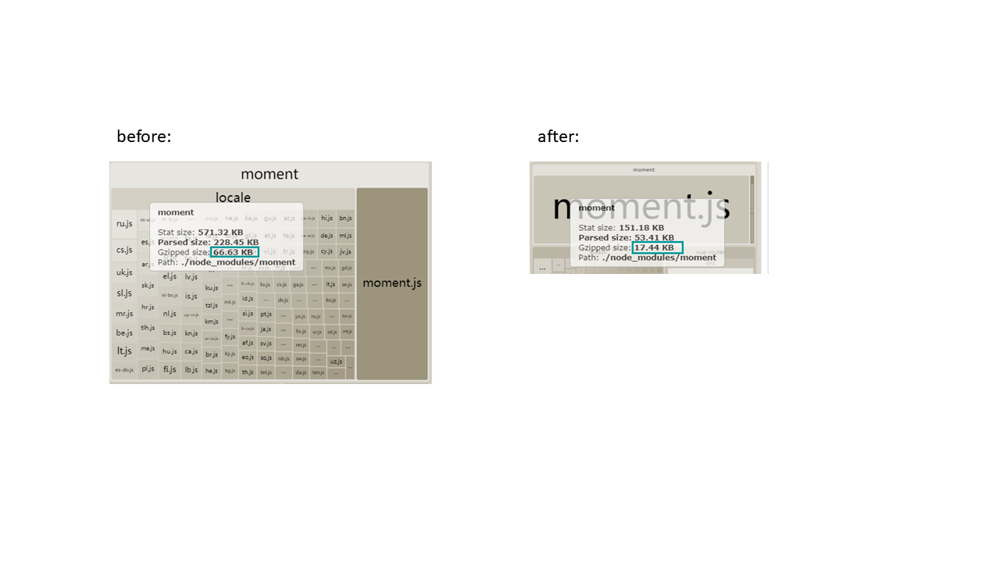
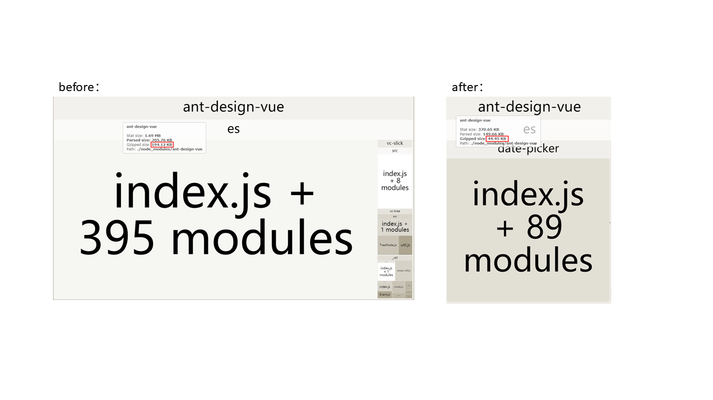
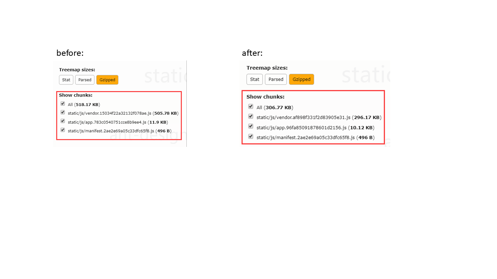

# reduce-antdv-project-bundle-size

> A demo show how to reduce ant design vue project bundle size.

## Build Setup

``` bash
# install dependencies
npm install

# serve with hot reload at localhost:8080
npm run dev

# build for production with minification
npm run build

# build for production and view the bundle analyzer report
npm run build --report
```

For a detailed explanation on how things work, check out the [guide](http://vuejs-templates.github.io/webpack/) and [docs for vue-loader](http://vuejs.github.io/vue-loader).

##  Optimize the moment internationalization file



## Icons load on demand


##  Components load on demand



## Bundle Size Contrast 

